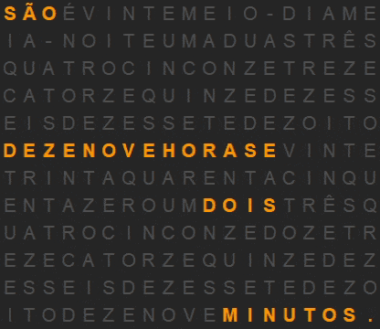
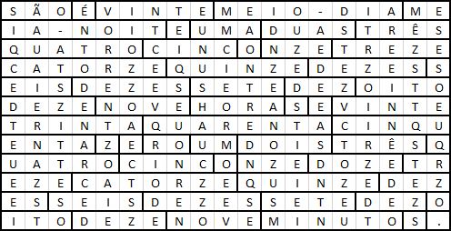

# Relógio de palavras

Implementação Python com TKinter de um relógio de palavras em português, já que existem diversos exemplos do mesmo
[relógio só que com o texto em inglês](https://www.google.com/search?tbm=isch&q=wordclock).

Conforme a hora atual, as palavras correspondentes são iluminadas em uma ordem que é legível. Na imagem a seguir estão
sendo mostradas horas e minutos aleatórios, mas no código a frase é conforme o relógio do sistema.

A intenção inicial era fazer ele físico, havia feito um primeiro esboço onde cada bloco seria iluminado conforme a hora
atual. Pode não ser a melhor disposição de palavras, na época queria fazer algo que fosse próximo de um quadrado.

Já que ficou parado por tanto tempo no computador, decidi fazer ele em Python,
baseado [neste tutorial](https://www.hashbangcode.com/article/creating-word-clock-python-and-tkinter).